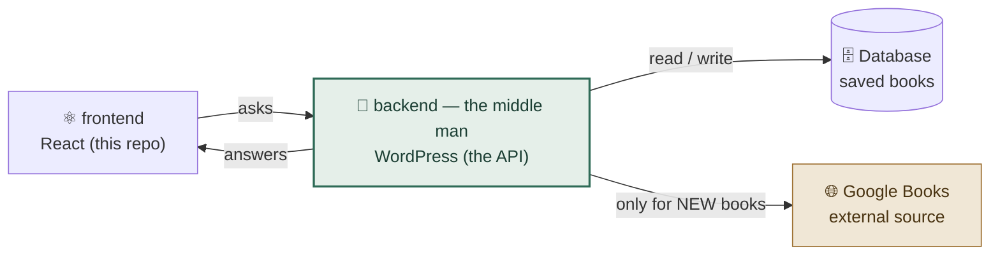
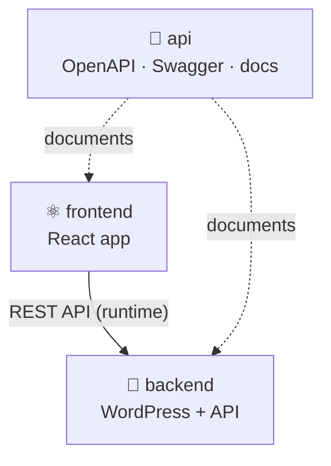
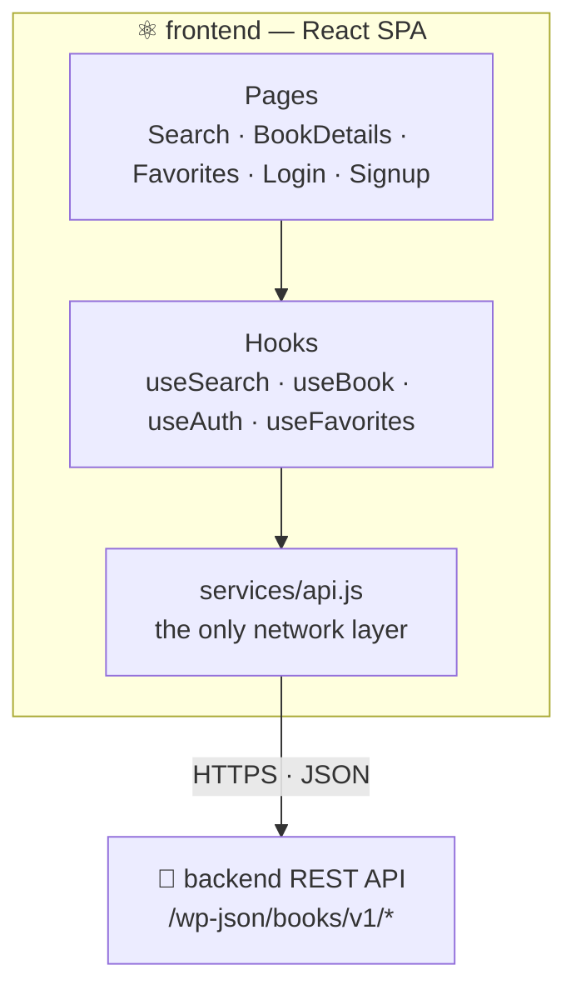
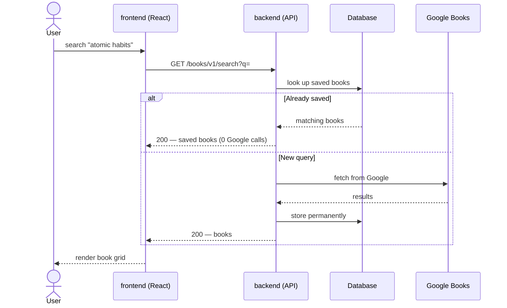
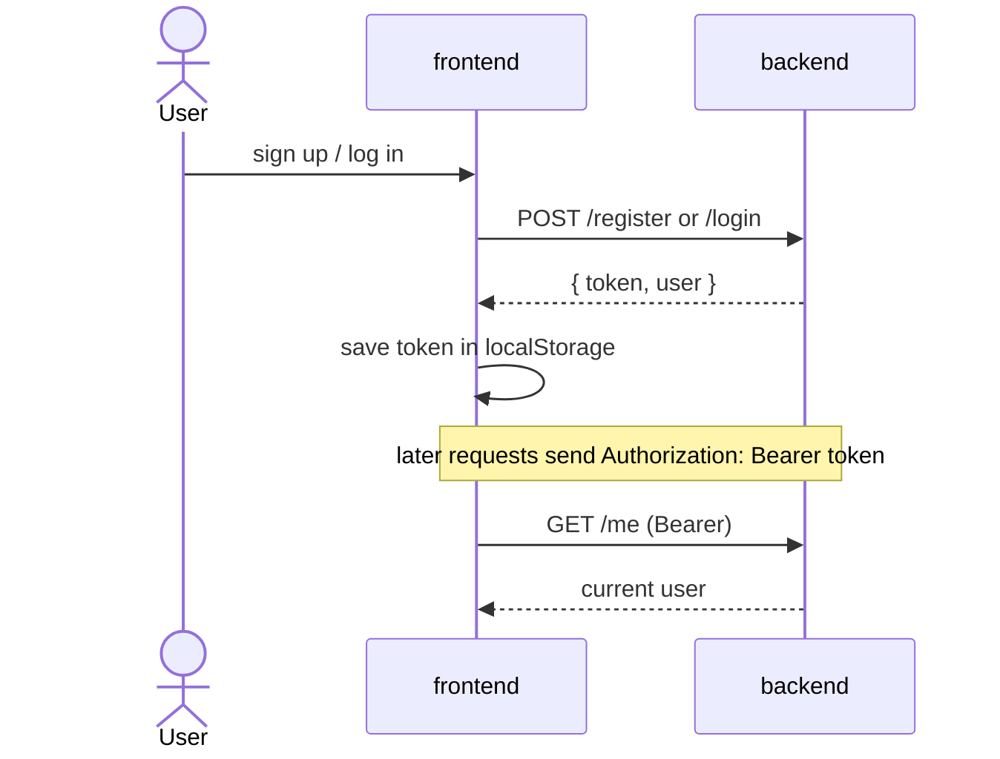

# Architecture

How this **frontend** fits into the Book Platform — a three-repository book discovery
app: a **React** frontend (this repo), a **WordPress** backend that *is* the API (the
middle man), and **Google Books** as the data source. Diagrams render on GitHub (Mermaid).

**Repos:** **frontend** (this) · [backend](https://github.com/malikjakexgroup/backend) · [api](https://github.com/malikjakexgroup/api)

---

## 1. The middle man (gateway)

This frontend never talks to Google. **The backend sits in the middle** — it decides,
stores, hides the API key, and serves clean data.

---

## 2. Three-repo map

---

## 3. What the frontend does (this repo)

- **Pages** render the UI; **hooks** manage data and auth state (TanStack Query);
  **`api.js`** is the single place that calls the backend.
- The frontend talks **only** to the backend — never to Google directly.

---

## 4. Flow — Search

---

## 5. Flow — Authentication

---

Full architecture (component view, data model, deployment, function-level pipeline) lives
in the **[api](https://github.com/malikjakexgroup/api)** repo. Live endpoint docs:
the api repo's **Swagger** page.
